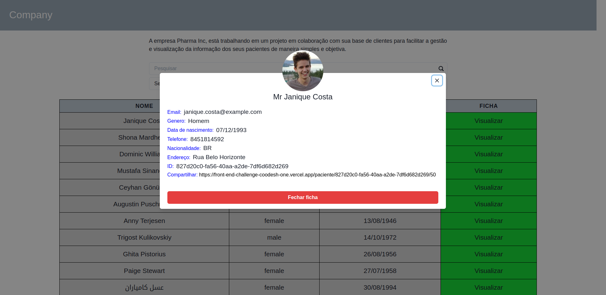

# Desafio front-end coodash

## O desafio consiste em receber dados de uma api e que seriam "pacientes" e organizar esses dados facilitando a visualização do mesmo, assim como uma URL que pudesse ser compartilhada com o "paciente" x
---

# Inicial

# Filtro

# Dados

## Qualquer sugestão você pode entrar em contato comigo pelas redes sociais
---

# Linkedin  https://www.linkedin.com/in/denner-bernardes/